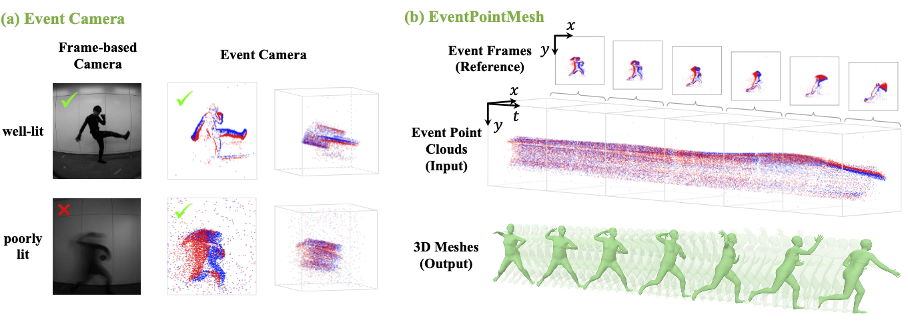
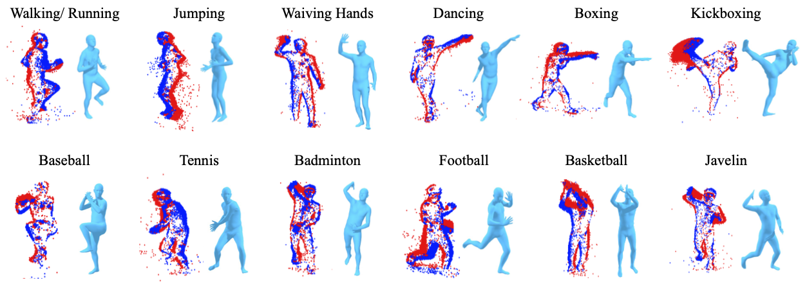

# EventPointMesh: Human Mesh Recovery Solely from Event Point Clouds

[](https://ryosukehori.github.io/EPM_ProjectPage/)

This is the official repository of EventPointMesh. Instructions for using the code and downloading the dataset are provided below.




## Environment Setup

To replicate our environment, run the following commands:

```bash
conda env create -f environment.yml
conda activate your-env-name
```

This will install all required packages as listed in `environment.yml`.


## SMPL Model Preparation

To run the code, SMPL model files are required.

1. Visit the official SMPL website: [https://smpl.is.tue.mpg.de/](https://smpl.is.tue.mpg.de/)
2. Register for access and download the following models:
   - `basicModel_m_lbs_10_207_0_v1.0.0.pkl`
   - `basicModel_neutral_lbs_10_207_0_v1.0.0.pkl`
3. Place these files in `src/smpl/` directory


## SMPL Model Conversion with mmMesh

Please follow these steps:

1. Visit the mmMesh [Xue *et al.*, 2021] repository:  
   [https://github.com/HavocFiXer/mmMesh/tree/master?tab=readme-ov-file#0-preliminary](https://github.com/HavocFiXer/mmMesh/tree/master?tab=readme-ov-file#0-preliminary)

2. Follow the instructions in "0. Preliminary" to generate:
   - `smpl_m.pkl`
   - `smpl_f.pkl`

3. Move the generated files into `src/smpl/` directory


## Training and Evaluation

To train or evaluate the model, navigate to the `src` directory and run the appropriate script:

```bash
cd src
python train.py   # For training
python test.py    # For evaluation
```

## 📥 Dataset Access


To request access to the EventPointMesh dataset, please fill out the following form:

👉 [Dataset Request Form](https://docs.google.com/forms/d/e/1FAIpQLSeWXSuuvF7pavsbHEDvNA9qFoqh2BtE8X0xqBNg2hjOYAfq0A/viewform?usp=header)

The dataset is provided **strictly for non-commercial academic research purposes**.  
You must agree to the license terms before downloading.  
**The download link will be shown immediately after submitting the form.**


